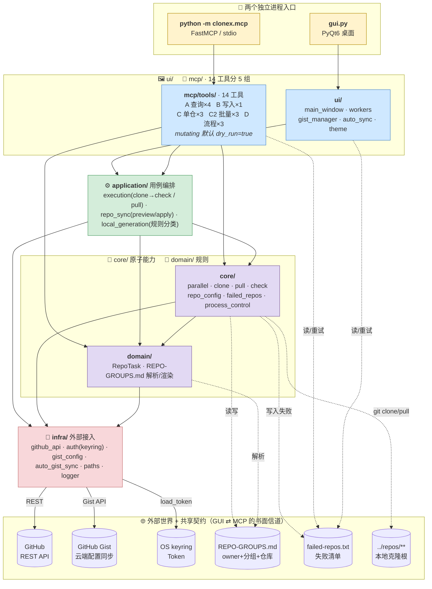
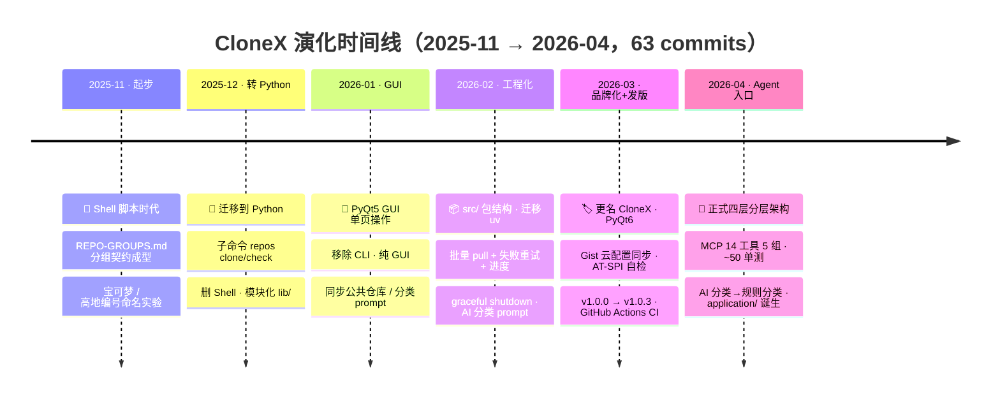

# CloneX 架构全景

> 一页读懂 CloneX 的整体构成与演化脉络。结构视角 + 演化视角并列，不做功能清单重复。功能清单见 `README.md`，MCP 工具详情见 `docs/MCP-GUIDE.md`。

## 一句话定位

同一套 Python 业务核心，以 **开发者 = PyQt6 GUI** 与 **AI Agent = MCP Server** 双入口输出能力。四层分层（`ui|mcp → application → core|domain → infra`）保证两条入口链路共享同一批原子能力，而不是各写一套。代码证据：`pyproject.toml` 同时声明 `clonex` 与 `clonex-mcp` 两个 entry point。

---

## 1. 结构视角

### 要点

- **依赖方向严格单向**：箭头永远朝下，`ui/mcp` 与 `application` 不互相依赖，`core/domain` 不知道上层存在。由 `AGENTS.md` 明文约束。
- **MCP 是薄适配，不是重实现**：`mcp/tools/batch.py` 直接调用 `core.parallel.execute_parallel_clone`，和 GUI `workers.py` 共用同一组线程池原语。
- **双入口共享契约是文件，不是调用**：GUI 写 `failed-repos.txt`，MCP 的 `retry_failed` 读同一份 —— 进程隔离下的串行协作（文档要求两者不同时跑）。
- **Agent 安全护栏**：所有写/执行类工具默认 `dry_run=true`，只有显式 `dry_run=false` 才落盘；错误统一 `{success, error:{code,message,hint}}`，见 `mcp/errors.py`。

---

## 2. 演化视角

### 要点

- **主线是"抽象层次单调上升"**：Shell → Python CLI → GUI → `src/` 包 → 正式四层分层。每一跳都在前一跳的代码上长出新层，没有推倒重来。
- **两次质变点**：
  1. **2026-01 移除 CLI 改纯 GUI**（commit `ac9805d`）—— 从命令行工具变成可视化工具，用户面从运维者扩展到普通开发者。
  2. **2026-04 引入 MCP + `application/`**（commit `e8d77a5`，当前 `HEAD`）—— 从"人用"变成"人 + Agent 共用"。`application/` 这一层正是被迫从 `core/` 抽出来，以便 MCP 工具和 GUI worker 共享多步编排。
- **一个反向简化**：早期有 AI 分类器（调 LLM 给仓库贴标签），2026-04 改为 `local_generation.py` 的**纯规则分类**（按 GitHub 返回的 `language` 字段）。逻辑：分类器让 Agent 自己做（拿 `list_repos` + 规则提示词即可），CloneX 本体不再维护 LLM 调用 —— 与"把能力暴露给 Agent"的主线一致。
- **v1.0.x 是工程化分水岭**：从 v1.0.0 起才有正式 tag、CI workflow、AT-SPI 无障碍自检、Gist 云配置 —— 从个人脚本走向可分发产品。

---

## 3. 速查表

| 维度 | 现状 |
|---|---|
| **入口** | GUI: `gui.py` → `ui.main_window.main` / MCP: `python -m clonex.mcp` → `mcp.server.main` |
| **分层顺序** | `ui \| mcp → application → core \| domain → infra` |
| **MCP 工具数** | 14 个（A 查询 4 + B 写入 1 + C 单仓 3 + C2 批量 3 + D 流程 3） |
| **共享契约文件** | `REPO-GROUPS.md`（分组配置） · `failed-repos.txt`（失败清单） · OS keyring（token） |
| **外部系统** | GitHub REST API · GitHub Gist · 本地 git |
| **打包产物** | `dist/CloneX`（PyInstaller onefile，GUI） · `clonex-mcp` entry point（MCP） |
| **测试三层** | `tests/mcp/` ~50 单测（内存 MCP） · `scripts/mcp_smoke.py`（真凭证） · MCP Inspector（手工） |

---

## 4. 关联文档

- `README.md` — 功能清单、Quick Start、完整项目结构
- `AGENTS.md` — 分层约束与自动重打包规则
- `docs/MCP-GUIDE.md` — MCP Server 使用、14 工具清单、测试三层策略
- `docs/BUILD.md` — PyInstaller 打包细节
- `docs/GIST-CONFIG-GUIDE.md` — Gist 云配置同步
